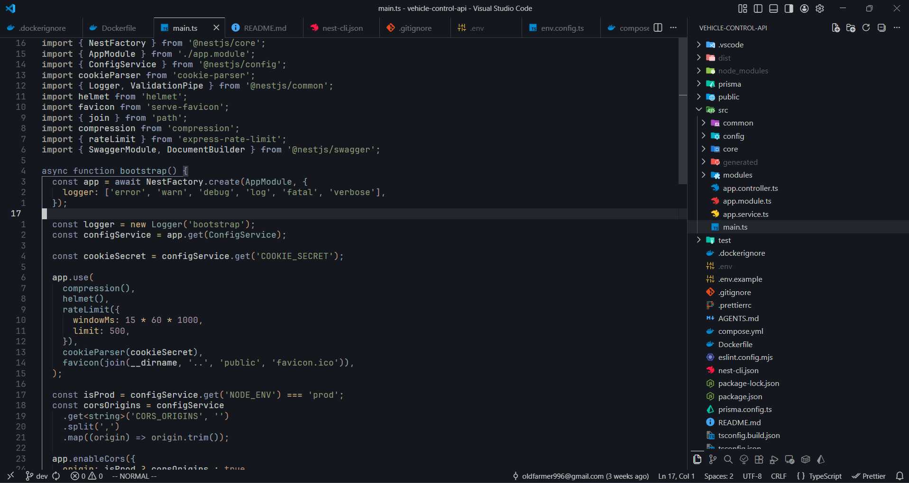
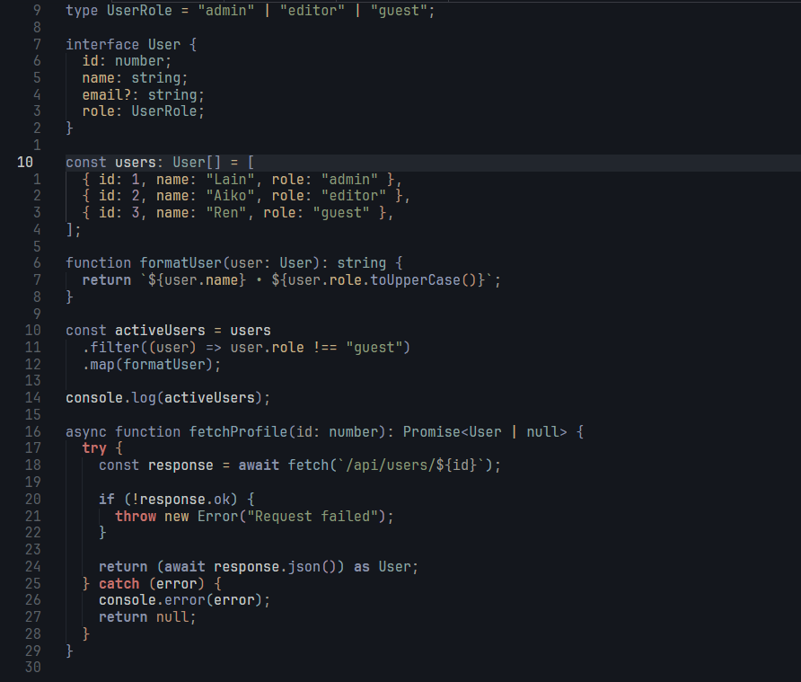
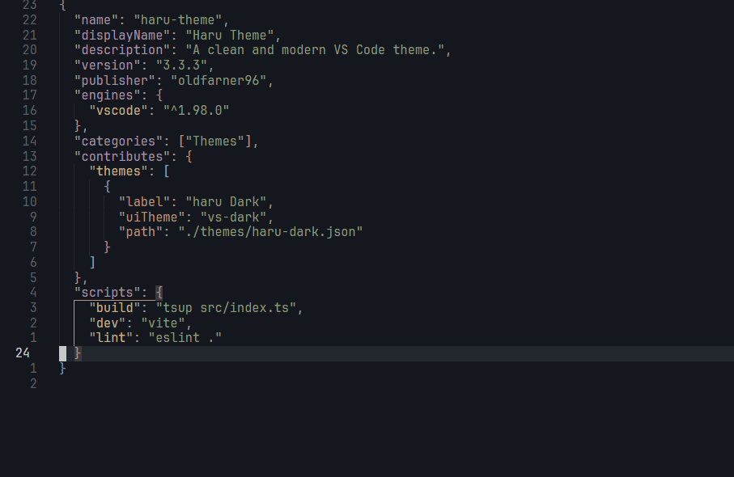
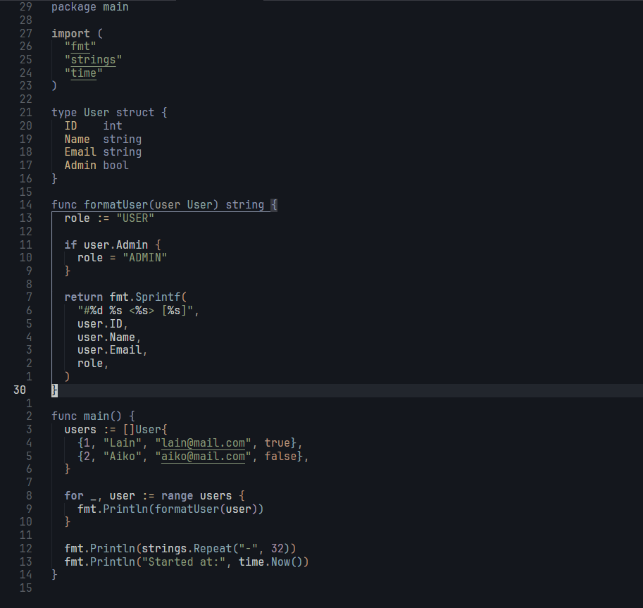
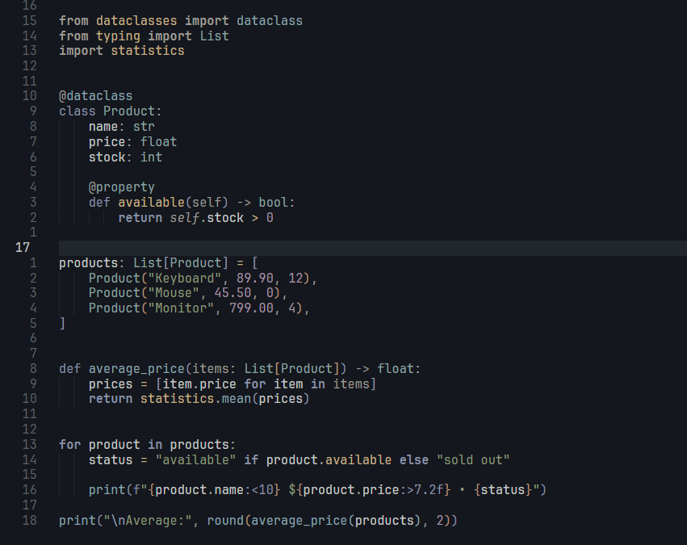

# Haru Zen Theme

A VS Code theme designed for deep focus. Haru Zen keeps visual noise low with calm, balanced colors so your attention stays on the code.



## Features

- Focus-first dark theme with soft contrast and clean UI surfaces.
- Semantic highlighting enabled for modern language servers.
- Tuned token colors for daily development (TypeScript, JSON, Go, Python, Markdown).
- Consistent editor, terminal, sidebar, and git gutter styling.

## Language Previews

> Preview placeholders are ready. Add your screenshots to these paths later.






## Color Palette

Core colors used by the theme:

| Token/UI Role     | Color     |
| ----------------- | --------- |
| Editor Background | `#14171d` |
| Editor Foreground | `#c5c9c7` |
| Selection         | `#393B42` |
| Keyword           | `#8992A7` |
| Function          | `#8BA4B0` |
| String            | `#8A9A7B` |
| Number            | `#A292A3` |
| Error             | `#E82424` |
| Warning           | `#FF9E3B` |

## Installation

### From VS Code Marketplace

1. Search for **Haru Theme** in the VS Code Marketplace.
2. Install the extension by **Oldfarmer96**.
3. Open **File > Preferences > Color Theme**.
4. Select **Haru Zen**.

### From command line

```bash
code --install-extension oldfarmer96.haru-theme
```

### Manual install (.vsix)

```bash
code --install-extension haru-theme-0.0.2.vsix
```

## Compatibility

- VS Code `^1.118.0` or newer.
- Works best with semantic token highlighting enabled (default in most setups).

## Changelog

See all release notes in `CHANGELOG.md`.

## Contributing

Contributions are welcome. If you want to improve token coverage, contrast, or language support, check `CONTRIBUTING.md` for setup and guidelines.

## Feedback

If you find readability issues or language-specific token problems:

- Open an issue with screenshots and file snippets.
- Mention language, VS Code version, and whether semantic highlighting is enabled.
- Include expected vs. current color behavior.

Repository: [oldfarmer96/haru-vscode](https://github.com/oldfarmer96/haru-vscode)

## Credits

Inspired by:

- [kanagawa.nvim](https://github.com/rebelot/kanagawa.nvim)
- [kanso-vscode](https://github.com/webhooked/kanso-vscode)

## License

MIT License. See `LICENSE`.
